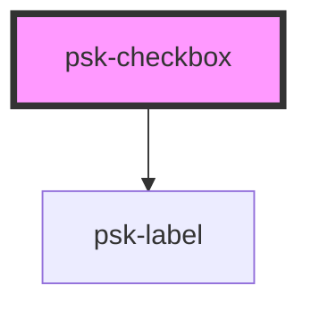

# psk-checkbox

<!-- Auto Generated Below -->

## Properties

| Property         | Attribute         | Description | Type      | Default     |
| ---------------- | ----------------- | ----------- | --------- | ----------- |
| `checkboxLabel`  | `checkbox-label`  |             | `any`     | `undefined` |
| `checked`        | `checked`         |             | `string`  | `null`      |
| `checkedValue`   | `checked-value`   |             | `string`  | `null`      |
| `label`          | `label`           |             | `string`  | `undefined` |
| `name`           | `name`            |             | `string`  | `null`      |
| `required`       | `required`        |             | `boolean` | `false`     |
| `uncheckedValue` | `unchecked-value` |             | `string`  | `null`      |
| `value`          | `value`           |             | `any`     | `false`     |

## Dependencies

### Depends on

- [psk-label](../psk-label)

### Graph

----------------------------------------------

*Built with [StencilJS](https://stenciljs.com/)*
