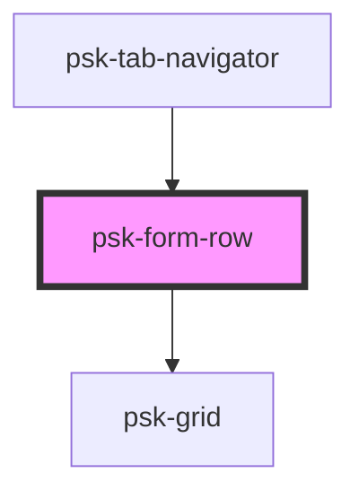

# psk-form-row

<!-- Auto Generated Below -->

## Properties

| Property | Attribute | Description | Type     | Default |
| -------- | --------- | ----------- | -------- | ------- |
| `layout` | `layout`  |             | `string` | `null`  |

## Dependencies

### Used by

 - psk-tab-navigator

### Depends on

- psk-grid

### Graph

----------------------------------------------

*Built with [StencilJS](https://stenciljs.com/)*
