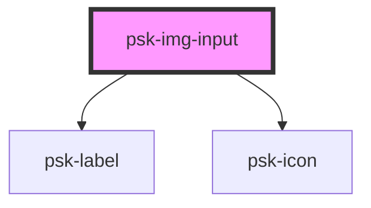

# psk-img-input

<!-- Auto Generated Below -->

## Properties

| Property      | Attribute     | Description | Type     | Default                         |
| ------------- | ------------- | ----------- | -------- | ------------------------------- |
| `alt`         | `alt`         |             | `string` | `null`                          |
| `eventName`   | `event-name`  |             | `string` | `'change'`                      |
| `label`       | `label`       |             | `string` | `null`                          |
| `placeholder` | `placeholder` |             | `string` | `'click here to select source'` |
| `src`         | `src`         |             | `any`    | `null`                          |

## Dependencies

### Depends on

- [psk-label](../psk-label)
- psk-icon

### Graph

----------------------------------------------

*Built with [StencilJS](https://stenciljs.com/)*
