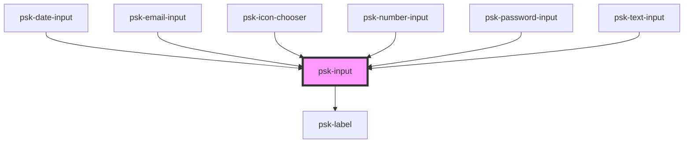

# psk-input

<!-- Auto Generated Below -->

## Properties

| Property         | Attribute          | Description                                                               | Type      | Default     |
| ---------------- | ------------------ | ------------------------------------------------------------------------- | --------- | ----------- |
| `dataDate`       | `data-date`        |                                                                           | `string`  | `undefined` |
| `dataDateFormat` | `data-date-format` |                                                                           | `string`  | `null`      |
| `invalidValue`   | `invalid-value`    |                                                                           | `boolean` | `null`      |
| `label`          | `label`            |                                                                           | `string`  | `null`      |
| `name`           | `name`             |                                                                           | `string`  | `null`      |
| `placeholder`    | `placeholder`      |                                                                           | `string`  | `null`      |
| `readOnly`       | `read-only`        |                                                                           | `boolean` | `false`     |
| `required`       | `required`         |                                                                           | `boolean` | `false`     |
| `specificProps`  | `specific-props`   | Property used only by other components psk-text-input, psk-email-input... | `any`     | `{}`        |
| `type`           | `type`             |                                                                           | `string`  | `'text'`    |
| `value`          | `value`            |                                                                           | `string`  | `null`      |

## Dependencies

### Used by

 - [psk-date-input](../psk-date-input)
 - [psk-email-input](../psk-email-input)
 - psk-icon-chooser
 - [psk-number-input](../psk-number-input)
 - [psk-password-input](../psk-password-input)
 - [psk-text-input](../psk-text-input)

### Depends on

- [psk-label](../psk-label)

### Graph

----------------------------------------------

*Built with [StencilJS](https://stenciljs.com/)*
