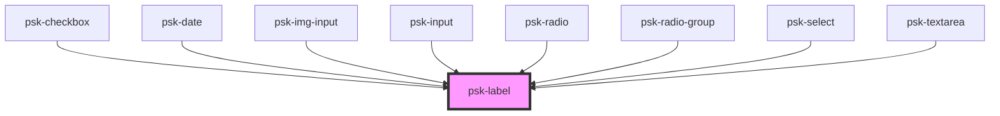

# psk-label

<!-- Auto Generated Below -->

## Properties

| Property | Attribute | Description | Type     | Default     |
| -------- | --------- | ----------- | -------- | ----------- |
| `for`    | `for`     |             | `string` | `null`      |
| `label`  | `label`   |             | `string` | `undefined` |

## Dependencies

### Used by

 - [psk-checkbox](../psk-checkbox)
 - psk-date
 - [psk-img-input](../psk-img-input)
 - [psk-input](../psk-input)
 - [psk-radio](../psk-radio)
 - [psk-radio-group](../psk-radio-group)
 - [psk-select](../psk-select)
 - [psk-textarea](../psk-textarea)

### Graph

----------------------------------------------

*Built with [StencilJS](https://stenciljs.com/)*
