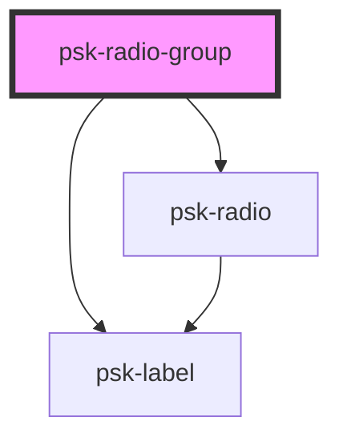

# psk-radio-group

<!-- Auto Generated Below -->

## Properties

| Property   | Attribute  | Description | Type      | Default |
| ---------- | ---------- | ----------- | --------- | ------- |
| `invalid`  | `invalid`  |             | `boolean` | `true`  |
| `label`    | `label`    |             | `string`  | `null`  |
| `name`     | `name`     |             | `string`  | `null`  |
| `required` | `required` |             | `boolean` | `false` |
| `value`    | `value`    |             | `string`  | `null`  |

## Dependencies

### Depends on

- [psk-label](../psk-label)
- [psk-radio](../psk-radio)

### Graph

----------------------------------------------

*Built with [StencilJS](https://stenciljs.com/)*
