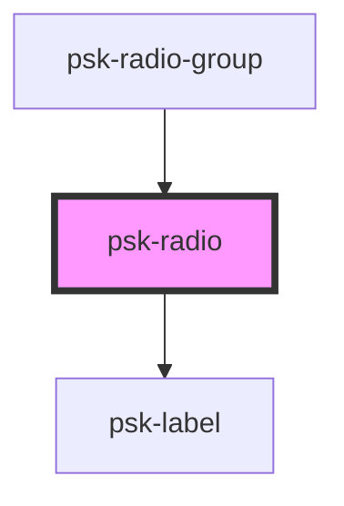

# psk-radio

<!-- Auto Generated Below -->

## Properties

| Property       | Attribute       | Description | Type      | Default |
| -------------- | --------------- | ----------- | --------- | ------- |
| `checked`      | `checked`       |             | `boolean` | `false` |
| `invalidValue` | `invalid-value` |             | `boolean` | `null`  |
| `label`        | `label`         |             | `string`  | `null`  |
| `name`         | `name`          |             | `string`  | `null`  |
| `readOnly`     | `read-only`     |             | `boolean` | `false` |
| `value`        | `value`         |             | `string`  | `null`  |

## Events

| Event           | Description | Type               |
| --------------- | ----------- | ------------------ |
| `onChangeRadio` |             | `CustomEvent<any>` |

## Dependencies

### Used by

 - [psk-radio-group](../psk-radio-group)

### Depends on

- [psk-label](../psk-label)

### Graph

----------------------------------------------

*Built with [StencilJS](https://stenciljs.com/)*
