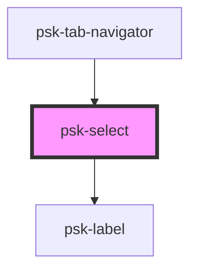

# psk-select

<!-- Auto Generated Below -->

## Properties

| Property        | Attribute        | Description | Type                     | Default     |
| --------------- | ---------------- | ----------- | ------------------------ | ----------- |
| `disabled`      | `disabled`       |             | `boolean`                | `false`     |
| `eventData`     | `event-data`     |             | `any`                    | `undefined` |
| `eventName`     | `event-name`     |             | `string`                 | `undefined` |
| `invalidValue`  | `invalid-value`  |             | `boolean`                | `null`      |
| `label`         | `label`          |             | `string`                 | `null`      |
| `placeholder`   | `placeholder`    |             | `string`                 | `null`      |
| `required`      | `required`       |             | `boolean`                | `false`     |
| `selectOptions` | `select-options` |             | `string`                 | `null`      |
| `selectionType` | `selection-type` |             | `"multiple" \| "single"` | `'single'`  |
| `value`         | `value`          |             | `string`                 | `null`      |

## Dependencies

### Used by

 - psk-tab-navigator

### Depends on

- [psk-label](../psk-label)

### Graph

----------------------------------------------

*Built with [StencilJS](https://stenciljs.com/)*
